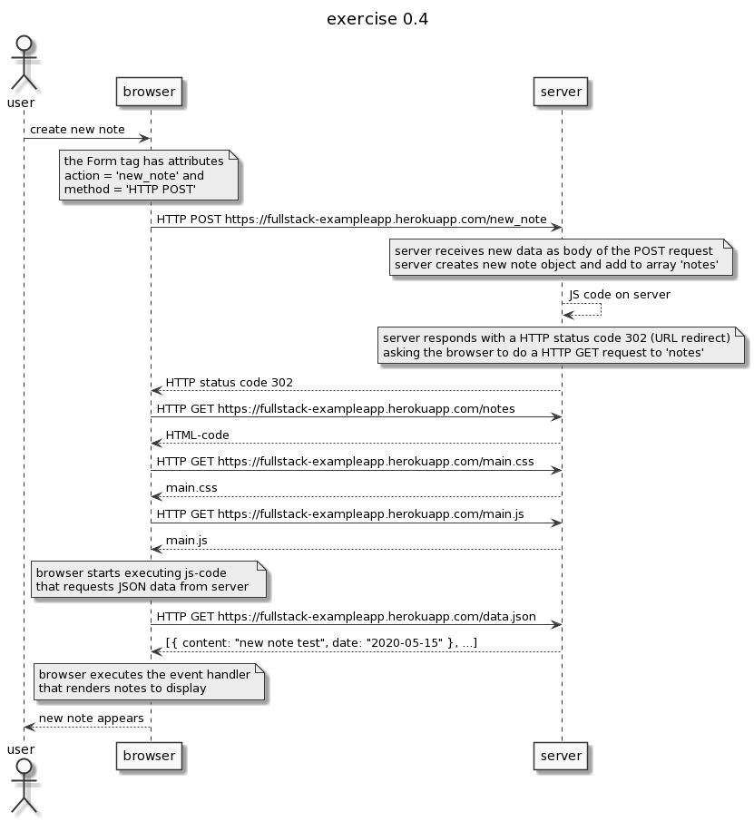

# Part 0 - Exercise 0.4




```
actor user

title exercise 0.4

user->browser: create new note

note over browser
the Form tag has attributes
action = 'new_note' and
method = 'HTTP POST'
end note

browser->server: HTTP POST https://fullstack-exampleapp.herokuapp.com/new_note

note over server
server receives new data as body of the POST request
server creates new note object and add to array 'notes'
end note

server-->server: JS code on server 

note over server
server responds with a HTTP status code 302 (URL redirect)
asking the browser to do a HTTP GET request to 'notes'
end note

server-->browser: HTTP status code 302
browser->server: HTTP GET https://fullstack-exampleapp.herokuapp.com/notes

server-->browser: HTML-code

browser->server: HTTP GET https://fullstack-exampleapp.herokuapp.com/main.css
server-->browser: main.css
browser->server: HTTP GET https://fullstack-exampleapp.herokuapp.com/main.js
server-->browser: main.js

note over browser
browser starts executing js-code
that requests JSON data from server 
end note

browser->server: HTTP GET https://fullstack-exampleapp.herokuapp.com/data.json
server-->browser: [{ content: "new note test", date: "2020-05-15" }, ...]

note over browser
browser executes the event handler
that renders notes to display
end note

browser-->user: new note appears
```