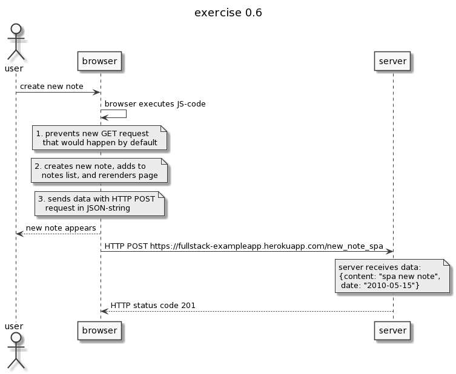

```
actor user

title exercise 0.6

user->browser: create new note

browser->browser: browser executes JS-code

note over browser
1. prevents new GET request
   that would happen by default
end note

note over browser
2. creates new note, adds to
   notes list, and rerenders page
end note

note over browser
3. sends data with HTTP POST
   request in JSON-string
end note

browser-->user: new note appears

browser->server: HTTP POST https://fullstack-exampleapp.herokuapp.com/new_note_spa

note over server
server receives data:
{content: "spa new note",
 date: "2010-05-15"}
end note

server-->browser: HTTP status code 201

```